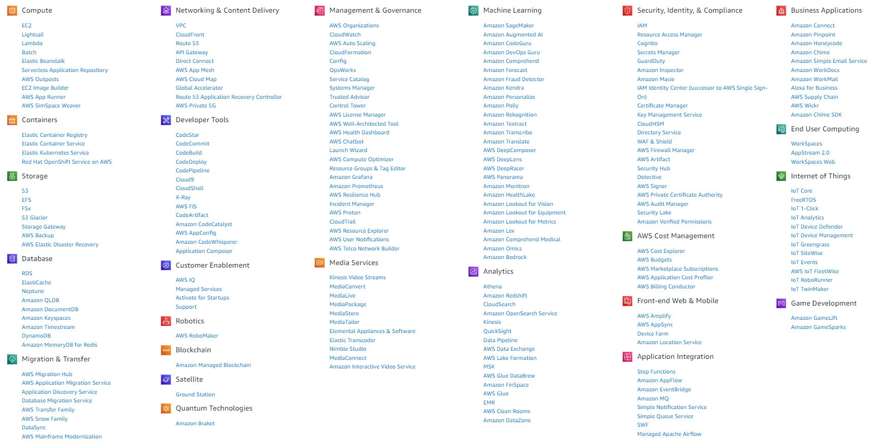

# Services



```
dotnet new console --name Services
```

## Storage
```
dotnet add package AWSSDK.S3
```
## Management & Governance
```
dotnet add package AWSSDK.CloudWatchLogs
```
## Application Integration
```
dotnet add package AWSSDK.SQS
```